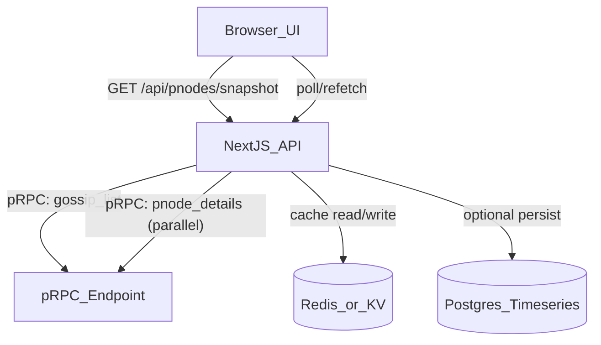

# Xandeum pNode Analytics Platform (Next.js)

## Goals (judging-aligned)

- **Functionality**: reliably discover **all pNodes in gossip** via pRPC, fetch per-node details, and display them.

- **Clarity**: present a “validator-dashboard style” experience: network overview, sortable list, detail pages, explainers.

- **User Experience**: fast, responsive, accessible UI; great loading/error states; strong information hierarchy.

- **Code quality**: explicit domain boundaries, typed APIs, testable modules, minimal coupling.

## Core product concept

A public dashboard that treats pNodes like validators:

- **Network Overview**: how many pNodes are in gossip, regions/ASNs distribution, software versions, health summary.

- **pNode Directory**: searchable/sortable table of all pNodes from gossip, with “health” and key metrics.

- **pNode Detail**: deep dive per pNode (identity, endpoints, version, last seen in gossip, latency, storage stats).

- **Compare**: compare 2–5 pNodes side-by-side.

- **Status/Incidents**: show recent degradations (missing from gossip, latency spikes, version drift).

## Architecture (hybrid data model)

You’ll combine:

- **Server aggregator (primary)**: Next.js Route Handlers call pRPC, normalize responses, cache, and serve the UI.

- **Client direct (secondary/optional)**: allow “Advanced → Direct pRPC mode” for power users (useful for debugging; keep off by default).

### Data flow

## Data contracts (make code clean)

Create **your own internal canonical schema** regardless of how pRPC formats data.

### Canonical types (example)

- `PNodeId`: stable identifier (pubkey / node id / identity string from pRPC).

- `PNodeGossipRecord`: minimal record from gossip list.

- `PNodeDetails`: richer, per-node data (version, endpoints, storage, etc.).

- `PNodeSnapshot`: merged view displayed in tables.

- `PNodeTimeseriesPoint`: (optional) time-series points for charts.

Use **runtime validation** (e.g., Zod) at the edge:

- `src/lib/prpc/schemas.ts`: parse pRPC responses → canonical types.

- Keeps UI and business logic insulated from pRPC changes.

## pRPC integration strategy (placeholder-driven, but implementation-ready)

Since exact pRPC methods/fields come from `xandeum.network → Docs`, treat them as plug-ins:

### Required capability

- **List pNodes in gossip**: `gossip_list_pnodes` (placeholder name)

### Recommended additional calls (if docs support)

- **Per-node info**: `pnode_getInfo(id)`

- **Per-node metrics**: `pnode_getMetrics(id)`

- **Network parameters**: `network_getInfo()`

### Implementation pattern

- `src/lib/prpc/client.ts`: thin JSON-RPC/HTTP client with timeouts/retries.

- `src/lib/prpc/methods.ts`: typed wrappers (the only place method names live).

- `src/lib/pnodes/service.ts`: orchestration: fetch gossip list → fan-out fetch details → normalize.

### Reliability rules

- Timeouts: ~3–5s per call; hard cap overall request.

- Parallelism limit: prevent stampedes (e.g., 10–25 concurrent detail calls).

- Cache:

    - **Snapshot cache** (30–60s TTL) for list page.

    - **Per-node cache** (30–120s TTL) for detail pages.

- Circuit breaker: if pRPC is failing, serve stale cache with “data may be delayed” banner.

## UI/UX spec (intuitive, validator-dashboard grade)

### Global UX principles

- **Information hierarchy**: “Is the network healthy?” → “Which pNodes are healthy?” → “Why is this one unhealthy?”

- **Progressive disclosure**: show the essentials first; deep metrics behind tabs.

- **Fast perception**: skeleton loaders, optimistic cached renders, and clear empty/error states.

- **Accessibility**: keyboard navigation, visible focus, ARIA for tables/charts, color-safe status chips.

### Pages

1) **Home / Overview** (`/`)

- Top KPI cards: `pNodes_in_gossip`, `healthy_count`, `degraded_count`, `avg_latency`, `version_distribution`.

- Charts:

    - pNodes by region/ASN

    - versions histogram

    - “last 24h gossip presence” sparkline

- CTA: “View all pNodes”.

2) **pNode Directory** (`/pnodes`)

- Table with:

    - identity (short id + copy)

    - status chip (Healthy/Degraded/Unknown)

    - last seen (relative time)

    - latency (ms)

    - version

    - region/ASN (if derivable)

    - storage capacity / used (if available)

- UX features:

    - search + filters (status, version, region)

    - column sorting

    - saved views (query params)

    - “Compare” checkbox flow

3) **pNode Detail** (`/pnodes/[id]`)

- Header: name/id + status + key quick stats + “copy endpoint/id”.

- Tabs:

    - **Overview**: key metrics + last seen timeline.

    - **Performance**: latency chart, error rate.

    - **Storage**: capacity/used charts + growth.

    - **Meta**: raw pRPC payload viewer (collapsible, for transparency).

4) **Compare** (`/compare?ids=a,b,c`)

- Side-by-side cards + a few aligned charts.

5) **About / Methodology** (`/about`)

- Explain where data comes from (gossip), caching, refresh cadence, limitations.

### Visual system

- Next.js + Tailwind + a component library (e.g., shadcn/ui) for consistent primitives.

- Status colors with icons + text (never color-only).

- Charts: Recharts or ECharts; keep consistent axes and units.

## Clean code structure (high-signal to judges)

Recommended Next.js App Router layout:

- [`app/`](app/)

    - [`app/layout.tsx`](app/layout.tsx): global shell, nav, theme.

    - [`app/page.tsx`](app/page.tsx): overview.

    - [`app/pnodes/page.tsx`](app/pnodes/page.tsx): directory.

    - `[app/pnodes/[id]/page.tsx](app/pnodes/[id]/page.tsx)`: detail.

    - [`app/api/pnodes/snapshot/route.ts`](app/api/pnodes/snapshot/route.ts): list endpoint.

    - `[app/api/pnodes/[id]/route.ts](app/api/pnodes/[id]/route.ts)`: per-node endpoint.

- [`src/lib/prpc/`](src/lib/prpc/) (infrastructure)

    - `client.ts`, `methods.ts`, `schemas.ts`

- [`src/lib/pnodes/`](src/lib/pnodes/) (domain)

    - `types.ts`, `service.ts`, `scoring.ts`, `formatters.ts`

- [`src/components/`](src/components/) (shared UI)

    - `DataTable/`, `KpiCard.tsx`, `StatusChip.tsx`, `Sparkline.tsx`

- [`src/features/pnodes/`](src/features/pnodes/) (screens)

    - `PNodeTable.tsx`, `PNodeFilters.tsx`, `PNodeDetailTabs.tsx`

### Code conventions

- “Methods live in one place”: only `src/lib/prpc/methods.ts` knows RPC method strings.

- “Schemas at the boundary”: only `schemas.ts` touches unknown JSON.

- “No UI fetch spaghetti”: UI uses a single data layer (TanStack Query) hitting your `/api/...`.

## Scoring / status logic (clarity + UX)

Provide an explicit, explainable status model:

- `Healthy`: in gossip + latency under threshold + no recent errors.

- `Degraded`: in gossip but slow / partial metrics.

- `Missing`: not in gossip (for N minutes).

- `Unknown`: new/unreachable.

Add a transparent “Why this status?” tooltip listing rules.

## Optional “innovation” features (low risk, high wow)

- **Decentralization insights**: concentration by region/ASN; “Nakamoto-like” heuristic for pNodes.

- **Version drift detector**: highlight nodes behind latest.

- **Watchlist**: localStorage saved pNodes + quick badges.

- **Shareable links**: `/pnodes?status=degraded&region=...`.

- **Export**: CSV of filtered table.

## Testing & quality gates

- Unit tests for:

    - parsing/normalization (`schemas.ts`)

    - scoring (`scoring.ts`)

- Integration tests for:

    - `/api/pnodes/snapshot` with mocked pRPC

- E2E (Playwright):

    - directory loads, filters work, detail page renders.

## Deployment plan

- Host on Vercel (simple) or Fly.io (if you add background workers).

- Config via env vars:

    - `PRPC_HTTP_URL`

    - `CACHE_URL` (optional)

    - `ENABLE_DIRECT_PRPC=false` (default)

### Refresh strategy

- MVP: request-time caching.

- Upgrade: scheduled job every 1–5 minutes to precompute snapshots and store in cache/DB.

## Documentation deliverables (submission-ready)

- `README` sections:

    - what it does

    - how to run locally

    - required env vars

    - how data is fetched (gossip → details)

    - deployment steps

    - limitations

## Implementation todos

- **prpc-client**: Implement typed pRPC client + schema validation boundary.

- **pnodes-snapshot**: Implement server aggregator endpoints with caching and concurrency limits.

- **ui-overview**: Build overview page with KPIs + charts + graceful loading states.

- **ui-directory**: Build pNode table with filters, sorting, compare flow.

- **ui-detail**: Build pNode detail tabs + raw payload viewer.

- **quality**: Add tests (unit + integration + minimal e2e) and lint/format rules.

- **deploy**: Wire env vars, add caching provider, deploy to a public URL.